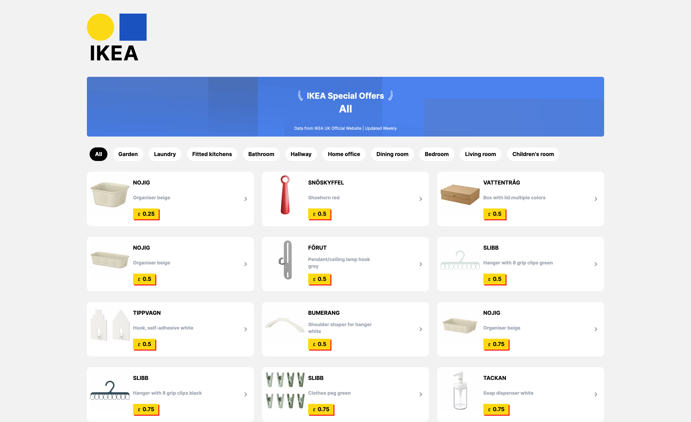

<div align="center">

# IKEA UK Product Scraper


</div>

This project is a web scraper for IKEA UK's website. It uses Scrapy to scrape product data and Next.js for the frontend.


## Features

- Discover the latest cheapest products from IKEA UK
- Categorize products by room type


## Prerequisites

Python scraper

```bash
python3 -m venv venv

source venv/bin/activate

pip install -r requirements.txt
```

Frontend

```bash
npm install
# or recommend
bun
```
## Scrape and format data

```bash
rm data.jsonl && touch data.jsonl

source venv/bin/activate

scrapy runspider main.py -o data.jsonl

python3 filter.py
```

- Display the data on a frontend page

```bash
npm run dev
# or
bun dev
```

Open [http://localhost:3000](http://localhost:3000) with your browser to see the result.

This is a [Next.js](https://nextjs.org/) project bootstrapped with [`create-next-app`](https://github.com/vercel/next.js/tree/canary/packages/create-next-app).

## Getting Started

First, run the development server:

```bash
npm run dev
# or
yarn dev
# or
pnpm dev
# or
bun dev
```

## Learn More

To learn more about Scrapy and Next.js, take a look at the following resources:

- [Scrapy Documentation](https://docs.scrapy.org/en/latest/index.html) - learn about Scrapy features and API.
- [Next.js Documentation](https://nextjs.org/docs) - learn about Next.js features and API.

## Acknowledgments
- [A Stackoverflow about scrape IKEA website](https://stackoverflow.com/questions/69751750/unable-to-go-to-next-page-with-scrapy)
- Inpiration from 宜家特价榜 [https://ikea-lp.netlify.app](https://ikea-lp.netlify.app/)
